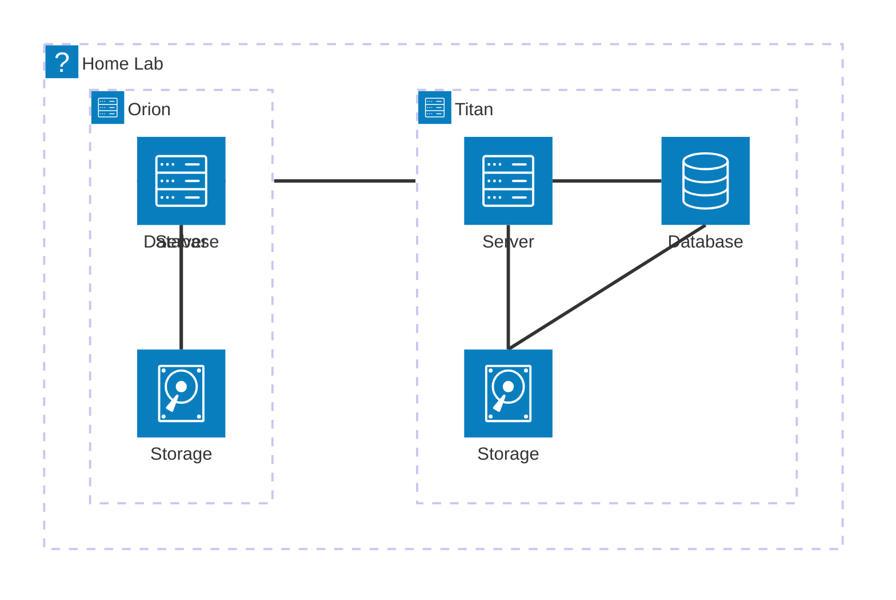

Example Architecture of Home Lab

```mermaid
architecture-beta
    group homelab(home)[Home Lab]
    
    group titan(server)[Titan] in homelab

	    service db(database)[Database] in titan
	    service disk1(disk)[Storage] in titan
	    service server(server)[Server] in titan

	    db:L -- R:server
	    disk1:T -- B:server
	    disk1:T -- B:db
	    
	group orion(server)[Orion] in homelab

	    service db2(database)[Database] in orion
	    service disk2(disk)[Storage] in orion
	    service server2(server)[Server] in orion

	    db2:L -- R:server2
	    disk2:T -- B:server2
	    disk2:T -- B:db2
	    
	server{group}:L -- R:server2{group}

```

---

